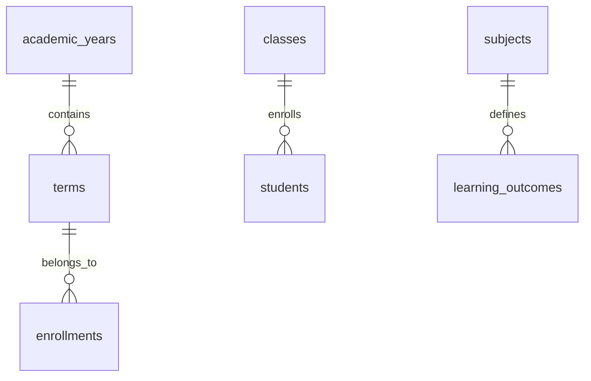
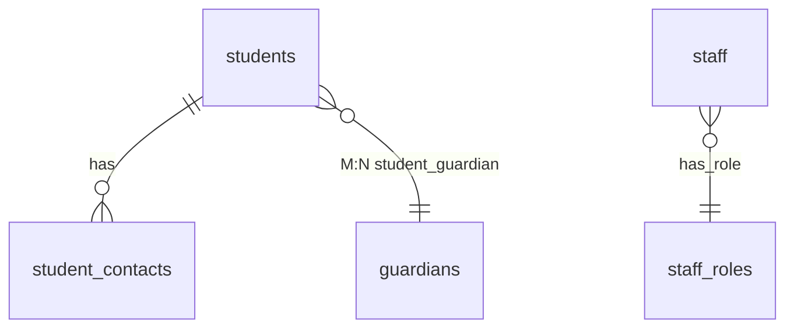
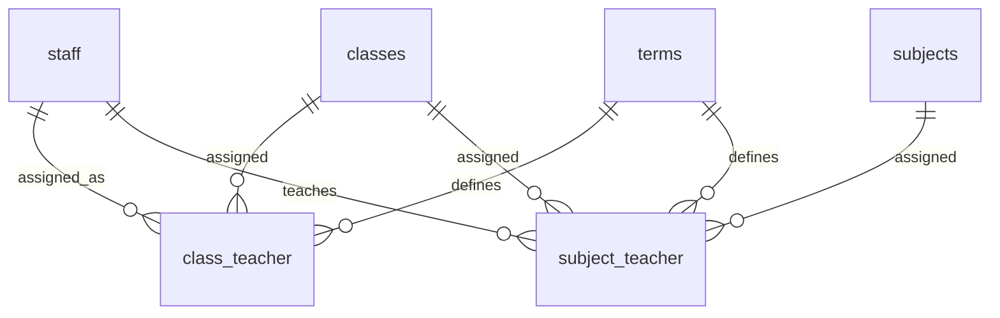
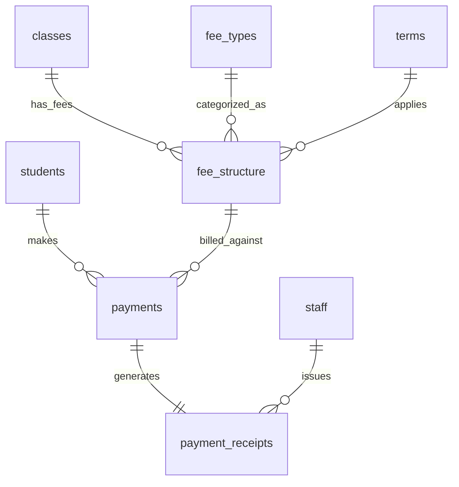
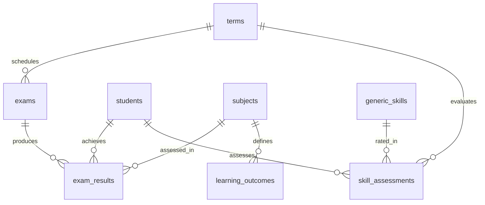
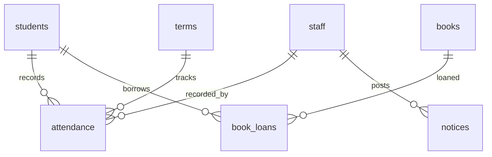
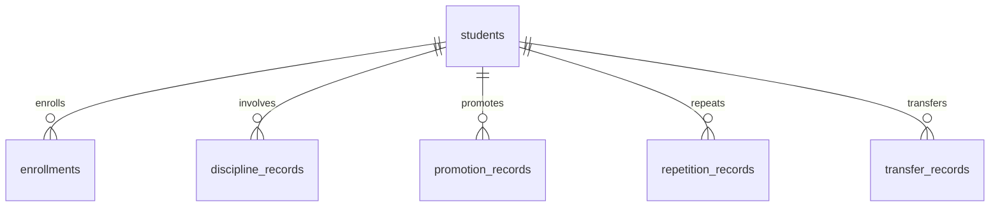
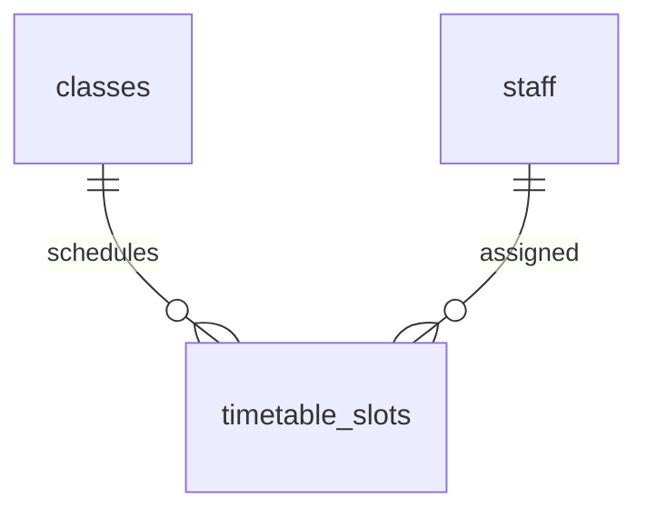

# SchoolPay — Enhanced Entity-Relationship (EER) Diagram

**Version:** 1.0
**Date:** June 2026
**Scope:** Ugandan secondary school (S1–S4) management system
**Author:** Opiyo Oscar
**Reg No:** 23/U/1330
**Student No:** 2300701330
**Track:** Web Development
**Source:** [erd-draft.md](./erd-draft.md) (this file) | [erd-draft.png](./erd-draft.png) (rendered)

---

## 1. Entity Catalog

### Reference / Lookup Entities (rarely change)

| # | Entity | Description | Status |
|---|--------|-------------|--------|
| 1 | `academic_years` | School calendar years (e.g. 2025, 2026) | **Planned** |
| 2 | `terms` | Term divisions within an academic year (Term 1–3) | Existing |
| 3 | `classes` | Class levels with stream (e.g. S1 East, S2 West) | Existing |
| 4 | `subjects` | Academic subjects (Math, English, Biology, ...) | Existing |
| 5 | `fee_types` | Fee categories (Tuition, Development, PTA, ...) | Existing |
| 6 | `books` | Library book inventory | Existing |
| 7 | `staff_roles` | Role definitions (Teacher, Bursar, Admin, Head Teacher) | **Planned** |
| 8 | `generic_skills` | Soft/skill categories for termly assessment | **Planned** |

### Transactional Entities (constantly change)

| # | Entity | Description | Status |
|---|--------|-------------|--------|
| 9 | `students` | Learner enrollment records | Existing |
| 10 | `student_contacts` | Guardian/parent/emergency contacts per student | Existing |
| 11 | `guardians` | Independent guardian entity (shared across siblings) | **Planned** |
| 12 | `staff` | Teaching and non-teaching staff | Existing |
| 13 | `class_teacher` | Assigns a teacher as class teacher for a term | Existing |
| 14 | `subject_teacher` | Assigns a teacher to teach a subject in a class for a term | Existing |
| 15 | `fee_structure` | Fee amounts per class × fee_type × term | Existing |
| 16 | `payments` | Payment transactions made by students | Existing |
| 17 | `payment_receipts` | Receipts generated for payments | Existing |
| 18 | `attendance` | Daily attendance records per student | Existing |
| 19 | `exams` | Exam event definitions per term | Existing |
| 20 | `exam_results` | Per-student, per-subject marks and grades | Existing |
| 21 | `book_loans` | Book borrowing records | Existing |
| 22 | `notices` | System-wide announcements | Existing |
| 23 | `enrollments` | Student enrollment in an academic year | **Planned** |
| 24 | `discipline_records` | Student discipline incidents | **Planned** |
| 25 | `skill_assessments` | Per-student, per-term generic skill ratings | **Planned** |
| 26 | `promotion_records` | Student promotion to next class | **Planned** |
| 27 | `repetition_records` | Student repeating a class | **Planned** |
| 28 | `transfer_records` | Student transfers in/out | **Planned** |
| 29 | `timetable_slots` | Class-teacher-subject-period schedule | **Planned** |
| 30 | `learning_outcomes` | CBC themes/topics per subject, with competencies & assessment criteria | **Planned** |

**Total: 30 entities** (18 existing, 12 planned)

---

## 2. EER Specializations & Generalizations

### Specialization: Staff (by role)

```
                    ┌──────────┐
                    │  Staff   │
                    └────┬─────┘
                         │ (role)
            ┌────────────┼────────────┬──────────────┐
            ▼            ▼            ▼              ▼
      ┌──────────┐ ┌──────────┐ ┌──────────┐  ┌────────────┐
      │ Teacher  │ │  Bursar  │ │  Admin   │  │Head Teacher│
      └──────────┘ └──────────┘ └──────────┘  └────────────┘
```

**Disjoint, attribute-defined** (single `role` column distinguishes subtypes).

### Specialization: TeachingStaff vs NonTeachingStaff

```
                    ┌──────────┐
                    │  Staff   │
                    └────┬─────┘
                         │ (teaches?)
                    ┌────┴────┐
                    ▼         ▼
            ┌────────────┐  ┌──────────────────┐
            │Teaching    │  │ NonTeachingStaff │
            │Staff       │  │ (Bursar, Admin,  │
            │(Teacher)   │  │  Head Teacher)   │
            └────────────┘  └──────────────────┘
```

### Specialization: Exam (by exam_type)

```
                    ┌──────────┐
                    │   Exam   │
                    └────┬─────┘
                         │ (exam_type)
           ┌─────────────┼──────────────┬──────────────┐
           ▼             ▼              ▼              ▼
    ┌────────────┐ ┌────────────┐ ┌──────────┐  ┌──────────┐
    │EndOfTerm   │ │Continuous │ │   Mock   │  │   UNEB   │
    │            │ │Assessment  │ │          │  │          │
    └────────────┘ └────────────┘ └──────────┘  └──────────┘
```

**Disjoint, attribute-defined** (single `exam_type` column).

### Category (Union): BookLoan Borrower

```
  ┌──────────────┐       ┌──────────────┐
  │   Student    │       │    Staff     │
  └──────┬───────┘       └──────┬───────┘
         │                      │
         └──────────┬───────────┘
                    │ (borrower)
                    ▼
            ┌──────────────┐
            │  BookLoan    │
            └──────────────┘
```

BookLoan can reference either a Student or a Staff as the borrower (union type).

---

## 3. Entity-Relationship Diagram

```mermaid
erDiagram
    academic_years ||--o{ terms : contains
    terms ||--o{ class_teacher : defines
    terms ||--o{ subject_teacher : defines
    terms ||--o{ fee_structure : applies
    terms ||--o{ exams : schedules
    terms ||--o{ attendance : tracks
    terms ||--o{ skill_assessments : evaluates
    terms ||--o{ enrollments : belongs_to

    classes ||--o{ students : enrolls
    classes ||--o{ class_teacher : assigned
    classes ||--o{ subject_teacher : assigned
    classes ||--o{ fee_structure : has_fees
    classes ||--o{ timetable_slots : schedules

    students ||--o{ student_contacts : has
    students ||--o{ enrollments : enrolls
    students ||--o{ payments : makes
    students ||--o{ attendance : records
    students ||--o{ exam_results : achieves
    students ||--o{ book_loans : borrows
    students ||--o{ discipline_records : involves
    students ||--o{ skill_assessments : assesses
    students ||--o{ promotion_records : promotes
    students ||--o{ repetition_records : repeats
    students ||--o{ transfer_records : transfers

    students }o--|| guardians : "student_guardian (M:N)"
    guardians ||--o{ student_contacts : listed_as

    staff ||--o{ class_teacher : assigned_as
    staff ||--o{ subject_teacher : teaches
    staff ||--o{ payment_receipts : issues
    staff ||--o{ attendance : recorded_by
    staff ||--o{ notices : posts
    staff ||--o{ timetable_slots : assigned

    staff }o--|| staff_roles : has_role

    subjects ||--o{ subject_teacher : assigned
    subjects ||--o{ exam_results : assessed_in
    subjects ||--o{ books : categorized

    fee_types ||--o{ fee_structure : categorized_as

    fee_structure ||--o{ payments : billed_against

    payments ||--|| payment_receipts : generates

    exams ||--o{ exam_results : produces

    books ||--o{ book_loans : loaned

    generic_skills ||--o{ skill_assessments : rated_in

    subjects ||--o{ learning_outcomes : defines
```



---

## 4. Module Breakdown (sub-diagrams)

### 4.1 Core Academic Structure



### 4.2 People Management



### 4.3 Staff Assignments



### 4.4 Finance



### 4.5 Academics & Assessment



### 4.6 Daily Operations



### 4.7 Student Lifecycle



### 4.8 Timetable



---

## 5. Relationship Matrix with Cardinalities

| Entity A | Relationship | Entity B | Cardinality | Example |
|----------|-------------|----------|-------------|---------|
| academic_year | contains | term | 1:N | One year (2025) has Term 1, Term 2, Term 3 |
| term | defines | class_teacher | 1:N | Term 1 assigns class teachers for that term |
| term | schedules | exam | 1:N | Term 1 has Mid-Term, End-Term exams |
| class | enrolls | student | 1:N | S1 East has 45 students |
| class | has | fee_structure | 1:N | S1 East has a fee structure |
| student | has | student_contact | 1:N | John has Mother + Father as contacts |
| student | makes | payment | 1:N | John makes 3 payments in a term |
| student | achieves | exam_result | 1:N | John has 8 subject results per exam |
| student | records | attendance | 1:N | John has 60 daily attendance records |
| student | borrows | book_loan | 1:N | John borrows 2 books |
| student | <–> | guardian | M:N | John has 2 guardians; Mrs. Smith has 3 children |
| staff | assigned_as | class_teacher | 1:N | Mr. Mutebi is class teacher for S1 East |
| staff | teaches | subject_teacher | 1:N | Mr. Mutebi teaches Math in S1 East |
| staff | has_role | staff_role | N:1 | 5 Teachers share "Teacher" role |
| subject | assessed_in | exam_result | 1:N | Math has 45 exam results (1 per student) |
| exam | produces | exam_result | 1:N | End-Term exam produces 360 results |
| fee_type | categorized_as | fee_structure | 1:N | "Tuition" appears in every class fee structure |
| payment | generates | payment_receipt | 1:1 | Each payment generates exactly one receipt |
| book | loaned | book_loan | 1:N | A book can be loaned multiple times |
| student | involves | discipline_record | 1:N | John has 2 discipline incidents |
| student | assesses | skill_assessment | 1:N | John has 5 skill ratings per term |
| student | promotes | promotion_record | 1:N | John promoted S1→S2 in 2025 |
| student | repeats | repetition_record | 1:N | Mary repeated S1 in 2025 |
| student | transfers | transfer_record | 1:N | Peter transferred from School X |
| class | schedules | timetable_slot | 1:N | S1 East has 40 weekly timetable slots |
| subject | defines | learning_outcome | 1:N | Math has 8 themes (Algebra, Geometry, Statistics, ...) |

---

## 6. Reference vs Transactional Classification

### Reference / Lookup (rarely changes)
```
academic_years    → Created once per year
terms             → Created once per term
classes           → Created when new stream opens
subjects          → Created when curriculum changes
fee_types         → Created once (Tuition, PTA, etc.)
books             → Added when new books arrive
staff_roles       → Created once (Teacher, Bursar, etc.)
generic_skills    → Created once (Punctuality, Teamwork, etc.)
```

### Transactional (constantly changes)
```
students          → Enrolled, promoted, transferred, graduated
student_contacts  → Updated when guardian info changes
guardians         → Added for new siblings
staff             → Hired, role-changed, departed
class_teacher     → Assigned per term
subject_teacher   → Assigned per term
fee_structure     → Updated per term
payments          → Recorded daily
payment_receipts  → Generated per payment
attendance        → Recorded daily
exams             → Created per term
exam_results      → Recorded per exam per student
book_loans        → Recorded per borrow/return
notices           → Posted as needed
enrollments       → Recorded per academic year
discipline_records→ Recorded per incident
skill_assessments → Recorded per term
learning_outcomes → Defined per subject, updated with curriculum
timetable_slots   → Created per term
promotion_records → Recorded year-end
repetition_records→ Recorded year-end
transfer_records  → Recorded per transfer
```

---

## 7. Entity State Legend

| Badge | Meaning |
|-------|---------|
| ✅ Existing | Fully implemented in current SQL schema |
| ⚠️ Partial | Partially implemented (needs refinement) |
| 📋 Planned | Defined in DBML but not yet in SQL schema |

### Current Status Per Entity

| Entity | Status | Notes |
|--------|--------|-------|
| `terms` | ✅ | Present in all schema variants |
| `classes` | ✅ | Present with class_name, stream, level |
| `students` | ✅ | Core entity with class_id FK |
| `student_contacts` | ✅ | Guardian contact details |
| `staff` | ✅ | Single table with role column |
| `class_teacher` | ✅ | Junction with term_id |
| `subjects` | ✅ | Subject catalog |
| `subject_teacher` | ✅ | M:N junction |
| `fee_types` | ✅ | Fee category lookup |
| `fee_structure` | ✅ | Class × FeeType × Term pricing |
| `payments` | ✅ | Transactional payment records |
| `payment_receipts` | ✅ | 1:1 with payments |
| `attendance` | ✅ | Daily per-student |
| `exams` | ✅ | Exam events per term |
| `exam_results` | ✅ | Marks per student per subject |
| `books` | ✅ | Library inventory |
| `book_loans` | ✅ | Borrow records |
| `notices` | ✅ | Announcements |
| `academic_years` | 📋 | Implicit in terms.academic_year; extract for clarity |
| `guardians` | 📋 | Currently embedded in student_contacts |
| `staff_roles` | 📋 | Currently an ENUM on staff.role |
| `generic_skills` | 📋 | Defined in DBML, not in schema |
| `skill_assessments` | 📋 | Defined in DBML, not in schema |
| `enrollments` | 📋 | Track year-by-year enrollment |
| `discipline_records` | 📋 | No SQL table yet |
| `promotion_records` | 📋 | No SQL table yet |
| `repetition_records` | 📋 | No SQL table yet |
| `transfer_records` | 📋 | No SQL table yet |
| `timetable_slots` | 📋 | No SQL table yet |
| `learning_outcomes` | 📋 | CBC themes/topics per subject with competencies |
